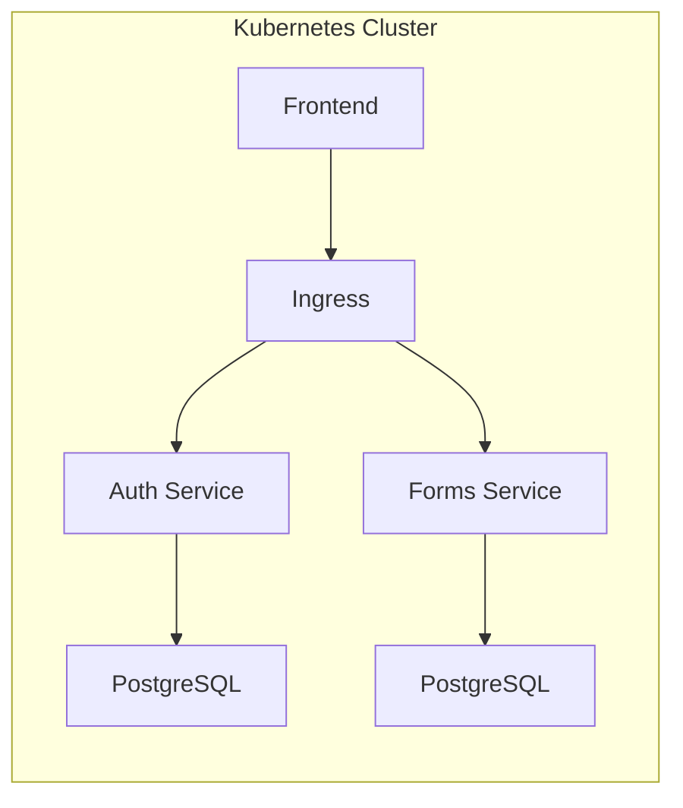
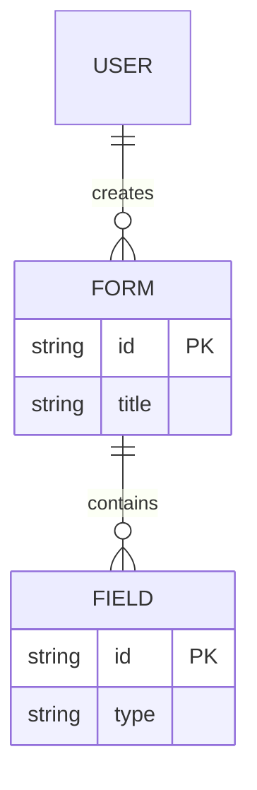

# System Architecture

## Component Diagram

```mermaid
flowchart LR
    subgraph Kubernetes Cluster
        A[Frontend] --> B[Ingress]
        B --> C[Auth Service]
        B --> D[Forms Service]
        C --> E[PostgreSQL]
        D --> F[PostgreSQL]
    end
```

## Database Schema

```mermaid
erDiagram
    USER ||--o{ FORM : creates
    FORM {
        string id PK
        string title
    }
    FORM ||--o{ FIELD : contains
    FIELD {
        string id PK
        string type
    }
```